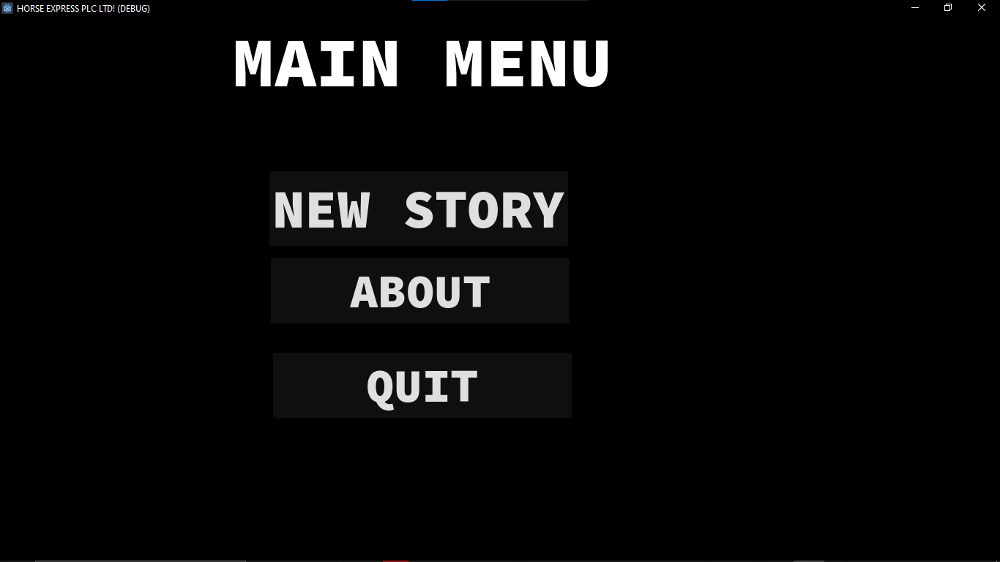
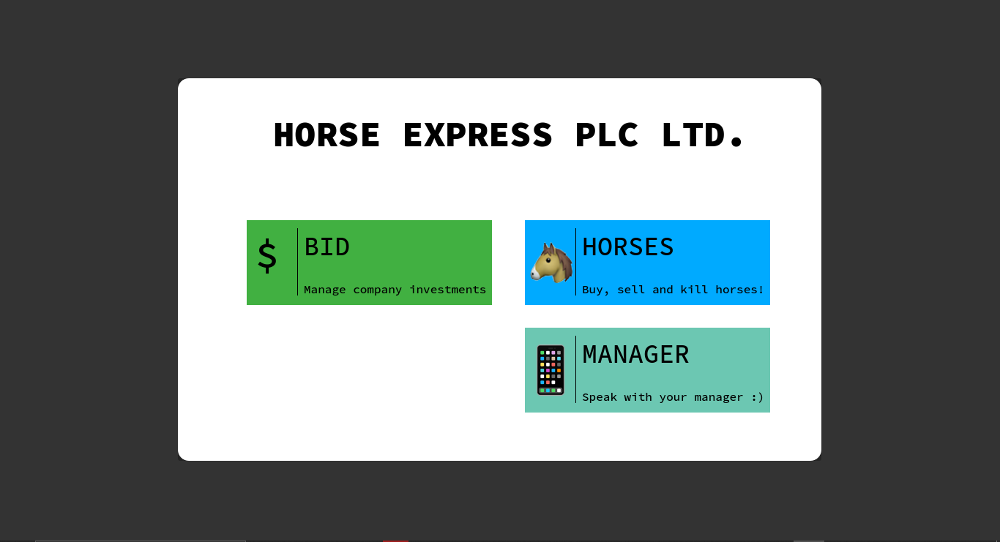
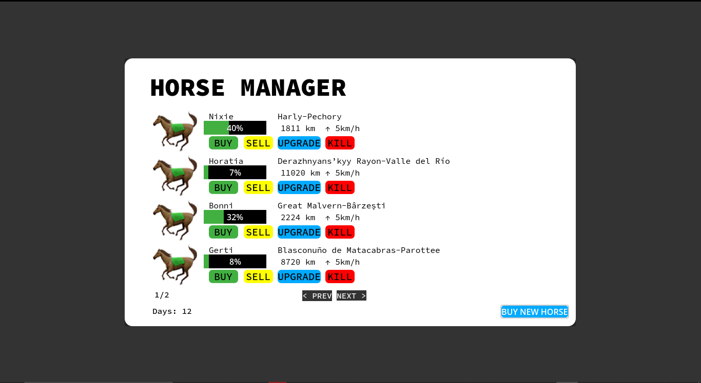
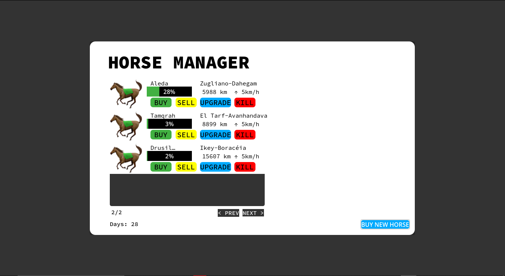

# Horse Express PLC
Horse Express PLC is a business-oriented game about horse-riding accross vast distances. Currently dosen't include monetary system or accurate land-only traversal but is now assumed that horses have a special water kit upgrade to walk on water

# Features
- Random City Extraction
- Pagination
- Random name generation
- Persisentency(game saves) *Not fully functional*

# Screenshots

# Built With
- [Godot 4.3](https://godotengine.org)
- [Figma](https://figma.com)

# Contributing

Contributions are what make the open source community such an amazing place to learn, inspire, and create. Any contributions you make are **greatly appreciated**.

If you have a suggestion that would make this better, please fork the repo and create a pull request. You can also simply open an issue with the tag "enhancement".
Don't forget to give the project a star! Thanks again!

1. Fork the Project
2. Create your Feature Branch (`git checkout -b feature/AmazingFeature`)
3. Commit your Changes (`git commit -m 'Add some AmazingFeature'`)
4. Push to the Branch (`git push origin feature/AmazingFeature`)
5. Open a Pull Request

(<a href="#readme-top">back to top</a>)

# Top contributors:

# Initial Contributors
- [Aiden Omondi](https://github.com/BrakingChanges) - *Initial work*

# Credits
- [Cities Database](https://github.com/dr5hn/countries-states-cities-database)
- [Horse Names](https://github.com/dominictarr/random-name/)
- [Source Code Pro Font](https://fonts.google.com/specimen/Source+Code+Pro)

